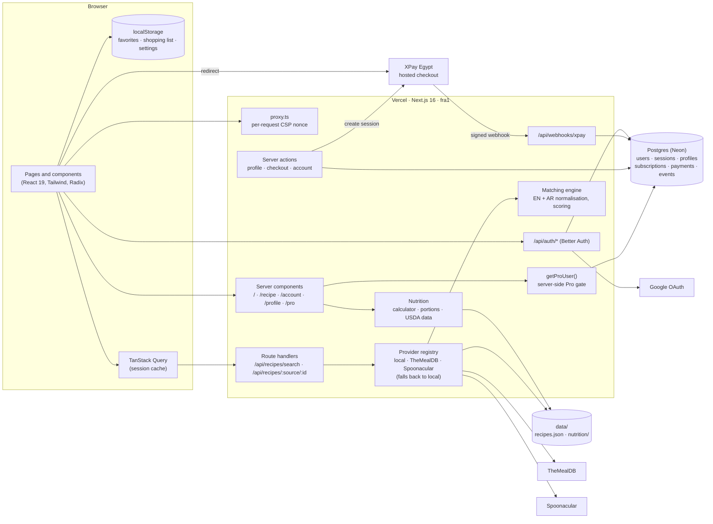
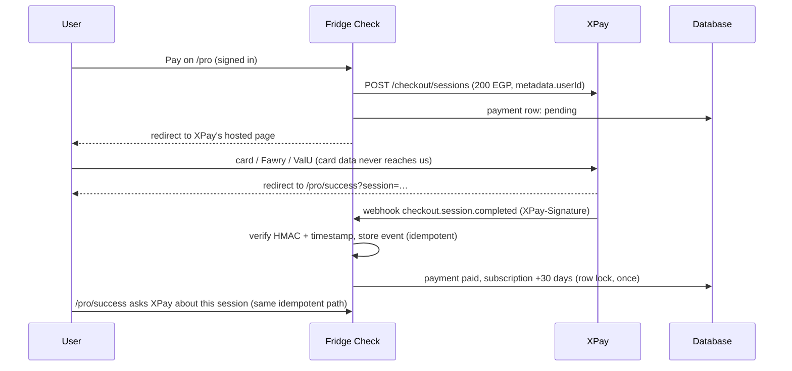

# Fridge Check

Find recipes from the ingredients you already have. Fridge Check ranks recipes by how well they
match your fridge, shows exactly which of your ingredients each recipe uses and what is missing, and
turns the gaps into a shopping list. Fully bilingual: English and Arabic (right-to-left).

**Live:** https://fridge-check-sooty.vercel.app

**Free, no account:**

- Type ingredients in English or Arabic.
- Ranked results show what each recipe uses and what's missing; filter by diet and sort.
- Recipe pages show have/need, unit conversion and a print layout.
- Favorites and a shopping list stay in the browser and sync across tabs.

**Fridge Check Pro** (Google sign-in, 200 EGP for 30 days through XPay Egypt):

- A nutrition profile gives daily calorie and macro targets.
- Every built-in recipe with complete data shows calories, protein, carbs and fat, in total and per
  ingredient.
- Your personal portion in grams for breakfast, lunch, dinner or a snack.
- How each meal fits your day.

## Architecture



How a Pro payment works:



Key decisions and their reasons are in [docs/PLAN.md](docs/PLAN.md); the visual system is in
[docs/DESIGN.md](docs/DESIGN.md); the steps before charging real customers are in
[docs/LAUNCH.md](docs/LAUNCH.md).

## Tech stack

| Area          | Choice                                                                            |
| ------------- | --------------------------------------------------------------------------------- |
| Framework     | Next.js 16 (App Router, Turbopack, `proxy.ts`), React 19, TypeScript 6 (strict)   |
| UI            | Tailwind CSS 4 (logical properties only), Radix UI, lucide icons, CSS-only motion |
| i18n          | next-intl 4 (no locale routing; cookie + localStorage), Western digits in Arabic  |
| Data fetching | TanStack Query 5 with a validated sessionStorage cache                            |
| Validation    | Zod 4 at every boundary (API input/output, storage, env, external APIs)           |
| Database      | PostgreSQL (Neon in production), Kysely, reversible migrations                    |
| Auth          | Better Auth, Google only                                                          |
| Payments      | XPay Egypt hosted checkout + signed webhooks                                      |
| Tests         | Vitest (unit, component, Postgres in-process via PGlite), MSW, Playwright + axe   |
| Hosting       | Vercel (functions in `fra1`, next to the database)                                |

## Getting started

Requirements: Node 24 (`.nvmrc`) and pnpm 10 (`corepack enable pnpm`). For sign-in and Pro
locally you also need PostgreSQL (developed on 16).

```bash
pnpm install
cp .env.example .env.local   # optional: the free app runs without any keys
pnpm dev                     # http://localhost:3000
```

Without any keys you get the free app with the 195 built-in recipes. To work on Pro locally:

```bash
createdb fridge_check_dev    # then DATABASE_URL=postgresql://<you>@localhost:5432/fridge_check_dev
pnpm db:migrate              # creates the tables
# then fill in the BETTER_AUTH_*, GOOGLE_* and XPAY_* settings (see below)
```

Keep the local database separate from the live one: `DATABASE_URL` is what the app and the
plain commands use; `PRODUCTION_DATABASE_URL` is used only by the `:prod` commands.

## Environment variables

Everything except `NEXT_PUBLIC_SITE_URL` is read on the server only; `pnpm check:bundle` fails the
build if a secret reaches the browser. Each one is documented in [.env.example](.env.example).

| Variable                                   | Needed for                                    | Where it comes from                                                                                      |
| ------------------------------------------ | --------------------------------------------- | -------------------------------------------------------------------------------------------------------- |
| `NEXT_PUBLIC_SITE_URL`                     | canonical and Open Graph links                | the public URL (on Vercel the production URL is used when empty)                                         |
| `RECIPE_PROVIDER`                          | `local` (default), `mealdb` or `spoonacular`  | your choice; any failure falls back to `local`                                                           |
| `SPOONACULAR_API_KEY`                      | Spoonacular search                            | spoonacular.com/food-api/console                                                                         |
| `THEMEALDB_API_KEY`                        | live TheMealDB                                | `1` (free test key, default) or a supporter key                                                          |
| `RATE_LIMIT_PER_MINUTE`                    | recipe API limit per IP                       | default 60; `0` turns it off                                                                             |
| `DATABASE_URL`                             | Pro                                           | Postgres connection string (Neon's pooled URL in production)                                             |
| `BETTER_AUTH_SECRET`                       | Pro                                           | `openssl rand -base64 32` (32+ characters)                                                               |
| `BETTER_AUTH_URL`                          | Pro                                           | the site's origin (`http://localhost:3000` locally)                                                      |
| `GOOGLE_CLIENT_ID`, `GOOGLE_CLIENT_SECRET` | Pro                                           | Google Cloud → Google Auth Platform → Clients; redirect URI `<BETTER_AUTH_URL>/api/auth/callback/google` |
| `XPAY_SECRET_KEY`, `XPAY_WEBHOOK_SECRET`   | Pro payments                                  | XPay dashboard → Developers → API keys / Webhooks (endpoint `<site>/api/webhooks/xpay`)                  |
| `FDC_API_KEY`                              | `pnpm seed:nutrition` only                    | fdc.nal.usda.gov/api-key-signup                                                                          |
| `PRODUCTION_DATABASE_URL`                  | the `:prod` maintenance commands (local only) | the live database's connection string                                                                    |

Pro switches itself on only when `DATABASE_URL`, both `BETTER_AUTH_*` and both `GOOGLE_*` are set;
otherwise every account entry point is hidden and the app stays account-free. Without the two
`XPAY_*` keys, signed-in users see Pro as "coming soon".

## Scripts

| Command                                                | What it does                                                                         |
| ------------------------------------------------------ | ------------------------------------------------------------------------------------ |
| `pnpm dev`                                             | Development server                                                                   |
| `pnpm build` / `pnpm start`                            | Validates the data, then production build / server                                   |
| `pnpm lint` · `pnpm typecheck` · `pnpm format:check`   | ESLint · route types + `tsc --noEmit` · Prettier (with Tailwind class sorting)       |
| `pnpm test` / `pnpm test:coverage`                     | Vitest (coverage gate: 90 % on `src/lib`)                                            |
| `pnpm e2e`                                             | Playwright end-to-end + axe accessibility on a production build (`pnpm build` first) |
| `pnpm check:css`                                       | Fails on physical `left`/`right` utilities: only RTL-safe logical ones are allowed   |
| `pnpm check:bundle`                                    | Fails if a server-only secret appears in the browser bundle (after `pnpm build`)     |
| `pnpm validate:data`                                   | Recipes reviewed and translated, nutrition data current (runs before every build)    |
| `pnpm seed` / `pnpm seed --reselect`                   | Rebuilds `data/recipes.json` from TheMealDB / re-runs the recipe selection first     |
| `pnpm seed:nutrition` / `--suggest --out <file>`       | Rebuilds `data/nutrition/foods.json` / proposes USDA foods for unmapped ingredients  |
| `pnpm db:migrate [up\|down\|status]`                   | Migrations on the local database                                                     |
| `pnpm db:migrate:prod [up\|down\|status]`              | The same on the live database (`PRODUCTION_DATABASE_URL`)                            |
| `pnpm pro:grant <email> [days]` / `pro:revoke <email>` | Testing only: gives or takes Pro without paying (`:prod` variants for the live site) |

## Project structure

```
data/                 recipes.json · seed-allowlist · diet/cuisine overrides · i18n/ · nutrition/
docs/                 PLAN.md (decisions) · DESIGN.md (visual system) · LAUNCH.md (go-live checklist)
messages/             en.json · ar.json
scripts/              seeds, data validation, migrations, Pro testing tool, CSS and bundle checks
src/app/              pages, route handlers (api/recipes, api/auth, api/webhooks/xpay), manifest
src/components/       search · recipe · pro · billing · account · saved · shopping · layout · ui
src/lib/matching/     ingredient normalisation (EN + AR), synonyms, families, staples, scoring
src/lib/providers/    local · TheMealDB · Spoonacular adapters, registry with fallback
src/lib/nutrition/    calculator (all formulas) · portions · USDA parsing · recipe nutrition
src/lib/billing/      XPay client · webhook handling · Pro access and gate · subscriptions
src/lib/db/           schema · migrations · Postgres client
src/lib/auth/         Better Auth (Google)
tests/                e2e/ · unit/ · msw/ (mock APIs) · db/ (PGlite test database)
```

## Recipes and ingredients

The app ships with 195 real recipes from [TheMealDB](https://www.themealdb.com) in
`data/recipes.json`. Nothing is invented: quantities and steps are kept as published.

- **Adding a recipe:**
  1. Add its TheMealDB id to `data/seed-allowlist.json` and run `pnpm seed`.
  2. Review its diet tags in `data/diet-overrides.json`, then run `pnpm seed` again.
  3. Give any new ingredient an Arabic name in `data/i18n/ingredients.ar.json` and a USDA mapping
     (see [Nutrition](#nutrition-pro)). `pnpm validate:data`, and so the build, fails until both
     exist.
- **Selection** (`src/lib/seed/select.ts`): per-cuisine quotas (more Egyptian, Saudi, British,
  American, Italian, French, Spanish, Chinese and Mexican recipes), quality gates and diet balance.
- **Ingredient names:**
  - English synonyms (e.g. "garbanzo" → "chickpea"): `src/lib/matching/synonyms.ts`.
  - Arabic spellings and dialect words: `src/lib/matching/config/arabic-aliases.ts`.
  - Families (e.g. "chicken breast" also counts for "chicken"): `src/lib/matching/families.ts`.
  - Staples assumed in every kitchen (salt, water…): `src/lib/matching/staples.ts`.
- **Diet tags** come from a conservative classifier and are then reviewed per recipe; the build
  fails if any recipe is unreviewed. Cuisine corrections live in `data/cuisine-overrides.json`.

## Languages and direction

- The language toggle (EN | AR) stores the choice in a `NEXT_LOCALE` cookie, so the server renders
  the right `lang`/`dir` on first paint, and mirrors it to `localStorage` (`fc:locale`).
- Layout uses only logical CSS (`ms-`/`me-`/`ps-`/`pe-`/`text-start`…), so Arabic mirrors without
  layout changes. `pnpm check:css` enforces this.
- Translations live in `messages/en.json` and `messages/ar.json`; a test fails if keys or
  placeholders differ. Numbers use Western digits in both languages.

## Nutrition (Pro)

- **Formulas** are all in one tested module,
  [`src/lib/nutrition/calculator.ts`](src/lib/nutrition/calculator.ts):
  - Mifflin-St Jeor BMR, multiplied by the activity level to get TDEE.
  - Calorie target: −20 % to lose fat, +10 % to gain muscle, never below 1,200 kcal (women) or
    1,500 kcal (men) unless TDEE itself is lower.
  - Protein 1.6–2.2 g/kg (at most 40 % of calories), fat 25–30 % of calories, carbs the rest.
  - Change a constant there, bump `FORMULA_VERSION`, and stored profiles are recalculated when read.
- **Portions:** the whole recipe is scaled to the chosen meal's share of the day (default
  breakfast 25 %, lunch 35 %, dinner 30 %, snack 10 %), each ingredient rounded to 5 g. See
  [`portions.ts`](src/lib/nutrition/portions.ts).
- **Data:** USDA FoodData Central (public domain).
  - [`data/nutrition/fdc-mapping.json`](data/nutrition/fdc-mapping.json) is the reviewed choice of
    USDA food for each ingredient, including canned and dried variants and documented weight
    overrides.
  - `pnpm seed:nutrition` generates `data/nutrition/foods.json` from it (needs `FDC_API_KEY`).
  - For new ingredients, run `pnpm seed:nutrition --suggest --out candidates.json`, review the
    candidates, and add the chosen ones to the mapping.
- **No guessing:** a line is weighed only through a USDA portion weight, a printed package size or
  a standard measure.
  - Small amounts, "to serve" items and frying oil are listed as not counted.
  - Anything else that can't be weighed makes the recipe show "nutrition not available". Today 140
    of the 195 recipes are complete.

## Pro and payments

- **Prepaid pass:** 200 EGP for 30 days. XPay Egypt can't renew automatically, so paying while
  already Pro extends from the current end date; the account page reminds you 5 days before.
- **Checkout** happens on XPay's hosted page (card, Fawry or ValU). Card details never reach this
  app; only XPay's ids are stored.
- **XPay's signed webhooks are the source of truth:**
  - The signature is HMAC-SHA256 over the raw body, accepted within 5 minutes.
  - Every event is stored in `webhook_event`; an event or checkout session is applied at most once.
  - The success page asks XPay directly about the user's own session through the same idempotent
    code, so Pro appears even before the webhook arrives.
- **Server-side gate:** every Pro feature checks `getProUser()` on the server. Free users are sent
  no nutrition numbers at all, only a locked preview.
- **Cancel** turns off renewal reminders; Pro stays until the period ends. A refund of the current
  period ends Pro immediately.
- **Checkout limit:** 5 checkout starts per user per hour.

**Testing in XPay test mode** (test keys, no real money):

1. Sign in, open `/pro` and pay.
2. Use card **5123 4500 0000 0008**: expiry **01/39** succeeds, **05/39** is declined.
   XPay then simulates the 3-D Secure step, where you choose Success or Failure.
3. On your own computer XPay's webhooks can't reach you, so the success page confirms the payment
   instead. On the deployed site the webhook does it too.
4. `pnpm pro:grant <email>` and `pnpm pro:revoke <email>` switch Pro on and off without paying.

## Testing

- **Unit and component:** Vitest (`src/**/*.test.ts(x)`, `scripts/`, `tests/unit/`).
  - Database code runs against real Postgres in-process (PGlite), with the real migrations.
  - External APIs (TheMealDB, Spoonacular, XPay) are mocked with MSW; unexpected requests fail.
  - The coverage gate is 90 % on `src/lib`.
- **End-to-end:** Playwright on desktop Chrome and a Pixel 7.
  - Covers search, recipe pages, favorites, the shopping list, both languages, keyboard use,
    320 px layouts, the security headers and the signed-out Pro pages.
  - axe checks every page in English and Arabic, light and dark.
- **CI** (GitHub Actions, every push): `pnpm audit --prod`, lint, format, types, logical CSS,
  unit tests with coverage, build, the secret scan, then e2e.

## Deployment

Vercel builds every push to `main`; functions run in `fra1` (`vercel.json`), next to the Neon
database in Frankfurt.

- **Settings:** production values live in Vercel → Settings → Environment Variables
  (or `vercel env add`). `BETTER_AUTH_URL` must be the production origin, and Google's redirect
  URI and XPay's webhook endpoint must point at it.
- **Schema changes:** run `pnpm db:migrate:prod` _before_ pushing code that needs them.
  Migrations are reversible (`pnpm db:migrate:prod down`).
- **Before charging real customers:** follow [docs/LAUNCH.md](docs/LAUNCH.md).

## Security and privacy

- **Content-Security-Policy** with a per-request nonce, `strict-dynamic` and no `eval`; forms may
  post only to this site and XPay's checkout. Also HSTS, `nosniff`, `X-Frame-Options: DENY`,
  `Cross-Origin-Opener-Policy`, `Referrer-Policy` and `Permissions-Policy`.
- **API keys** are used only on the server, and CI scans the browser bundle for them.
- **Server actions** take the user from the session, never from the form. Redirect targets after
  sign-in are restricted to this site.
- **Health data** (weight, height, birth year, sex) is stored only after explicit consent. Deleting
  the account deletes it; payments are kept as financial records without the user.

## Performance

Lighthouse 13, measured on the live site on 2026-10-09. Scores are performance · accessibility ·
best practices · SEO:

| Page           | Mobile (slow 4G)      | Desktop               |
| -------------- | --------------------- | --------------------- |
| Home           | 98 · 100 · 100 · 100  | 100 · 100 · 100 · 100 |
| Search results | 99 · 100 · 100 · 100  | 80 · 100 · 100 · 100  |
| Recipe         | 86 · 100 · 100 · 100  | 95 · 100 · 100 · 100  |
| Pro            | 100 · 100 · 100 · 100 | 100 · 100 · 100 · 100 |

Layout shift is 0 on every page and total blocking time at most 80 ms. The two slower results
wait on outside data: recipe photos come from TheMealDB as JPEG (mobile recipe LCP 4.2 s), and
desktop results show their first photos only after the search request (LCP 2.8 s).

## Known limitations

- **Pro renewal is manual** (XPay has no automatic renewal yet); reminders appear on the account
  page, not by email.
- **55 of the 195 built-in recipes** show "nutrition not available": they have lines like
  "8 prawns" or "1 pot sour cream" that can't be weighed honestly.
- **Spoonacular** recipes have no Pro nutrition. Its free plan (50 points a day, shared by all
  visitors) runs out quickly, and searches then fall back to the built-in recipes until it resets.
- **Recipe text** (titles, steps, measures) stays in English in both languages; the interface,
  ingredients, diets and cuisines are translated.
- **The recipe API rate limit** is kept in memory per server instance, so it is best effort.

## Credits

- Recipe data and photos: [TheMealDB](https://www.themealdb.com).
- Additional recipes: [spoonacular](https://spoonacular.com/food-api).
- Nutrition values: [USDA FoodData Central](https://fdc.nal.usda.gov) (public domain).
- Fonts: Bricolage Grotesque and Fustat (SIL Open Font License).
